# Inventory Sales Management System

A full-stack web application for managing inventory, sales, and orders with role-based access control.  Built with a modern tech stack featuring React on the frontend and Node.js/Express on the backend with MongoDB as the database.

## 📸 Screenshots

### 🏠 Public Pages

#### Home Page
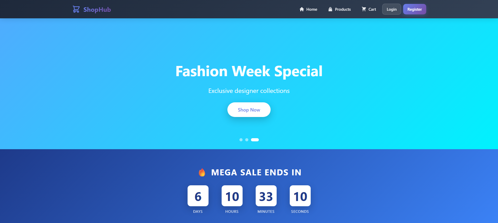
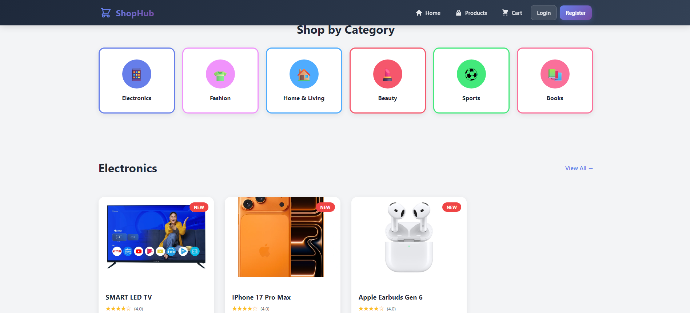
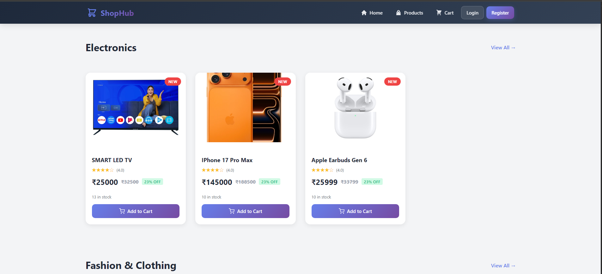
*Landing page with system overview and navigation*

#### Products Catalog
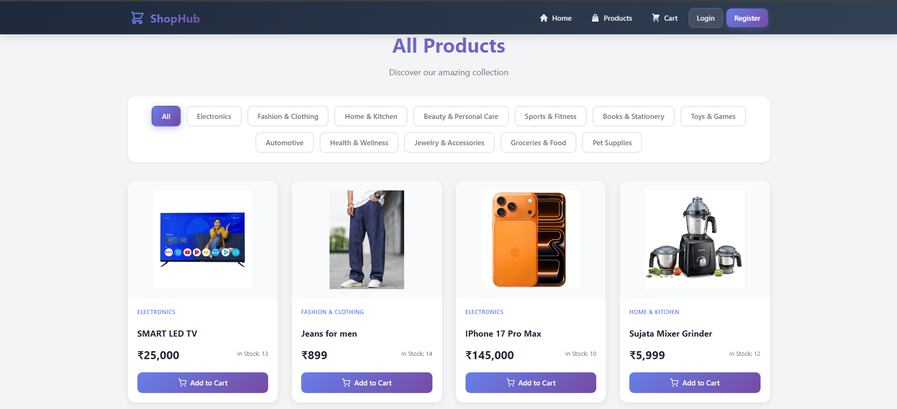
*Browse available products with search and filter options*

#### Shopping Cart
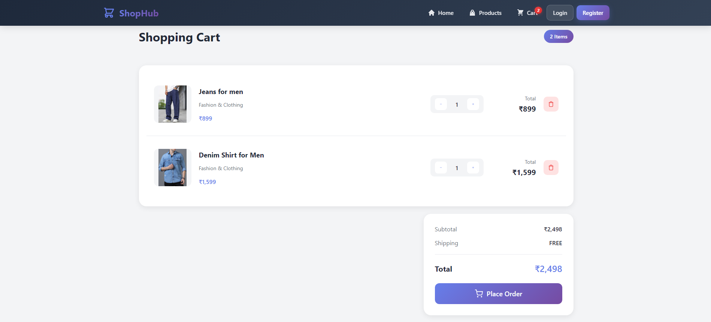
*Review items, update quantities, and proceed to checkout*

#### Login Page
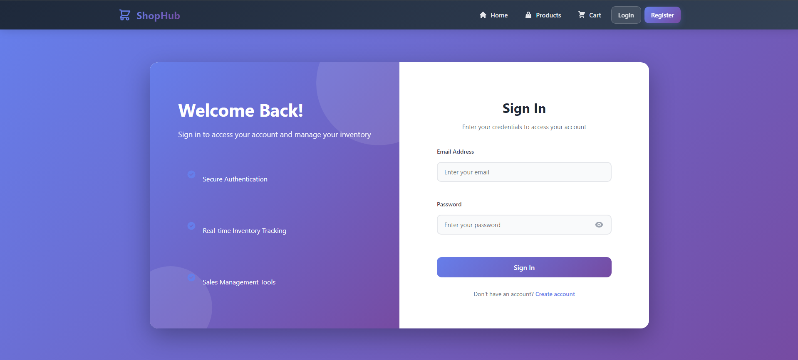
*Secure user authentication for all user types*

#### Register Page
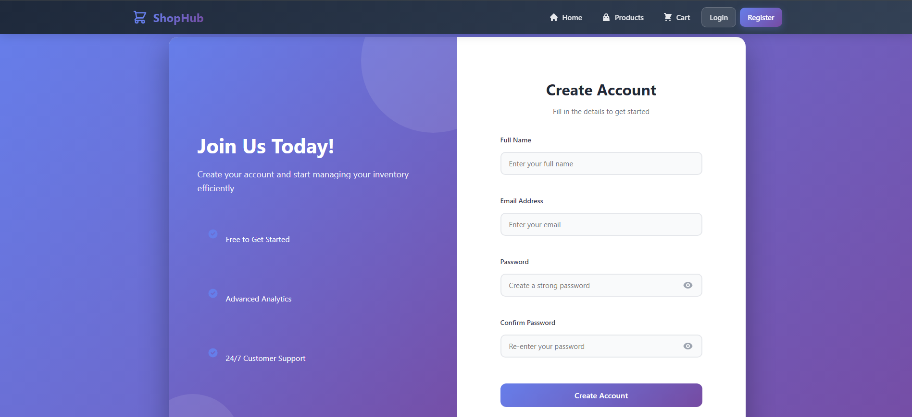
*New user registration with role selection*

---

### 👤 Customer Portal

#### Customer Dashboard

*Customer overview with quick access to shopping and orders*

#### Shopping Cart

*Review items, update quantities, and proceed to checkout*

#### My Orders
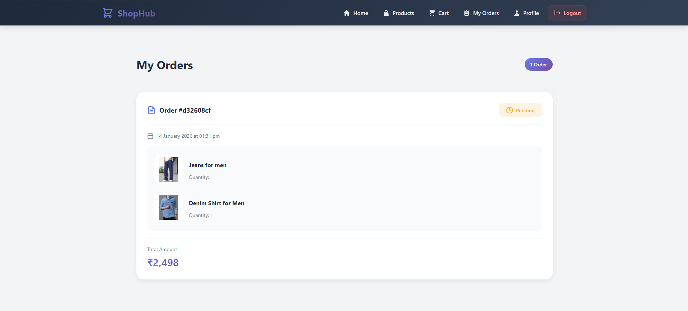
*View order history and track order status*

#### Customer Profile
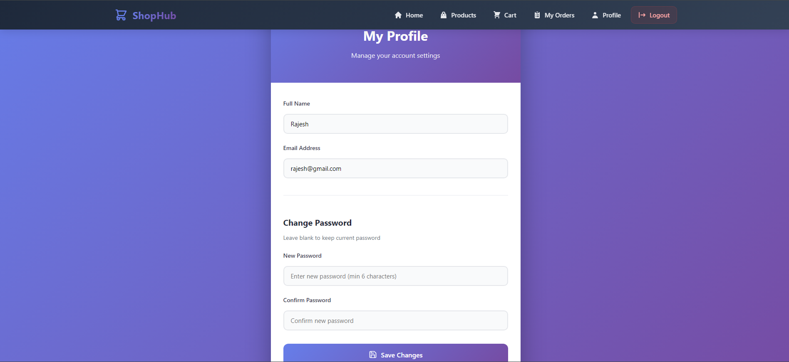
*Manage account information and preferences*

---

### 👔 Staff Portal

#### Manage Orders
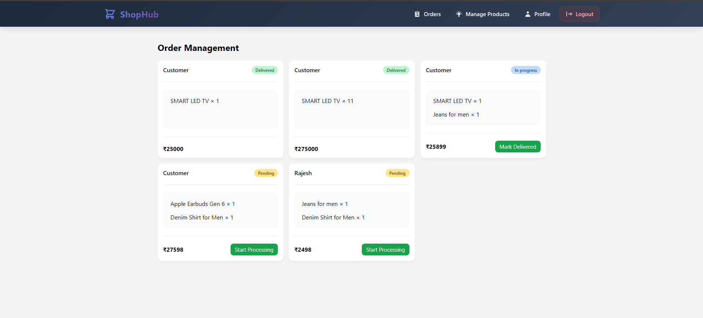
*View and process customer orders*

#### Inventory View
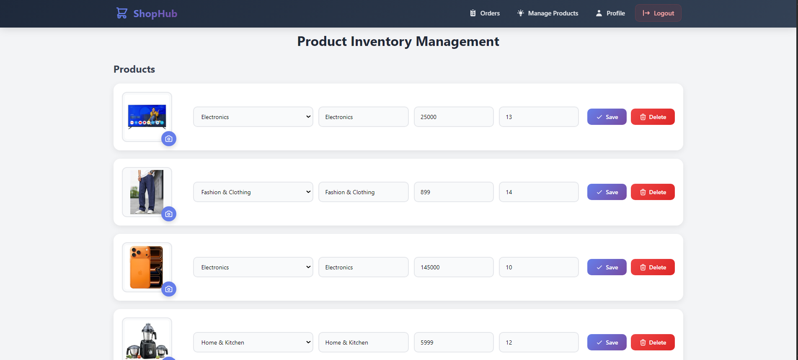
*Monitor stock levels and product availability*

#### Sales Records
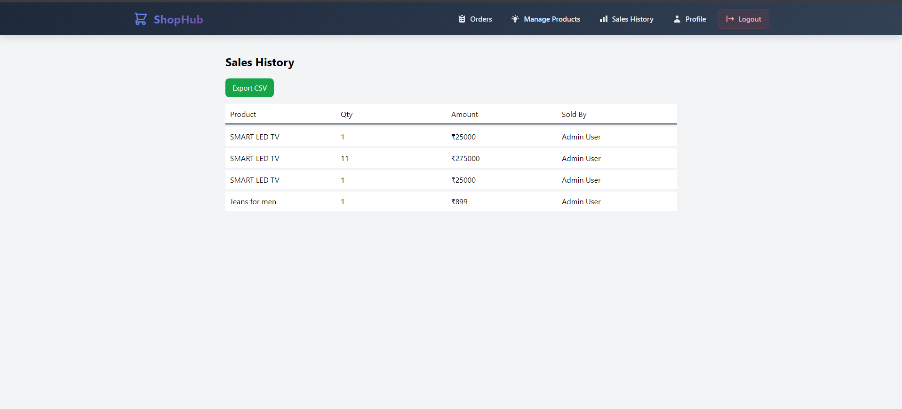
*View and record sales transactions*

#### Staff Profile
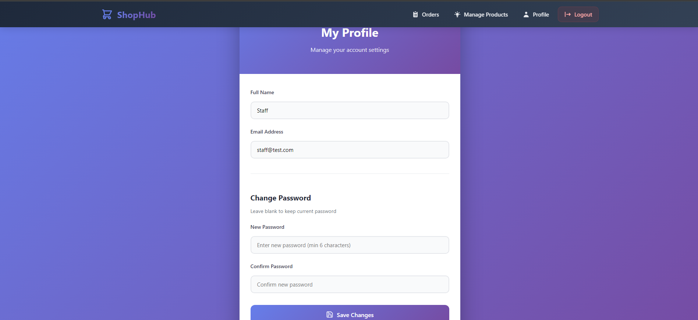
*Staff account management*

---

### 🔐 Admin Portal

#### Admin Dashboard
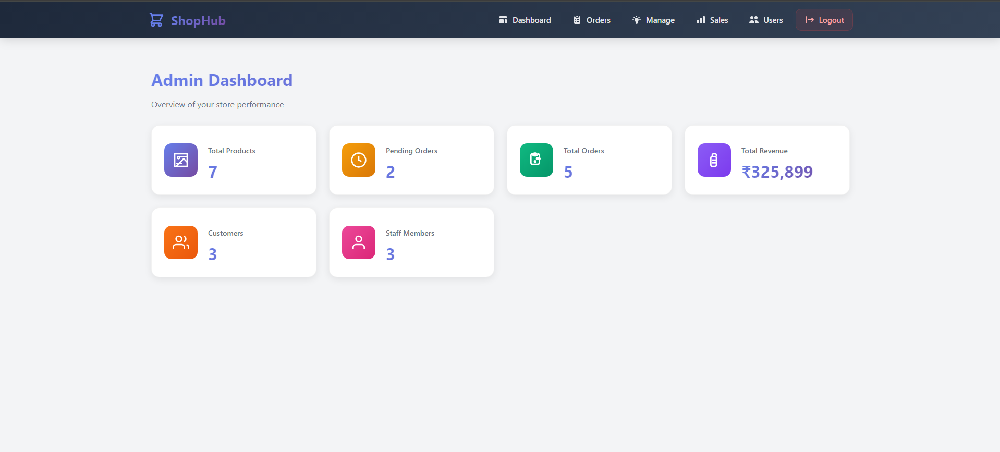
*Comprehensive overview with analytics, metrics, and system health*

#### Manage Products
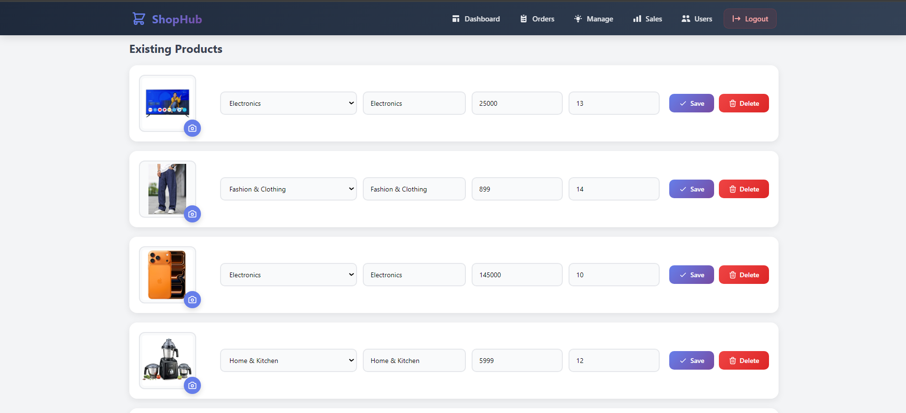
*Add, edit, delete, and organize products*

#### Add/Edit Product
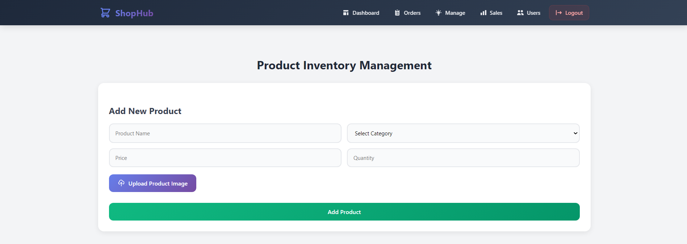
*Product creation and editing interface with image upload*

#### User Management
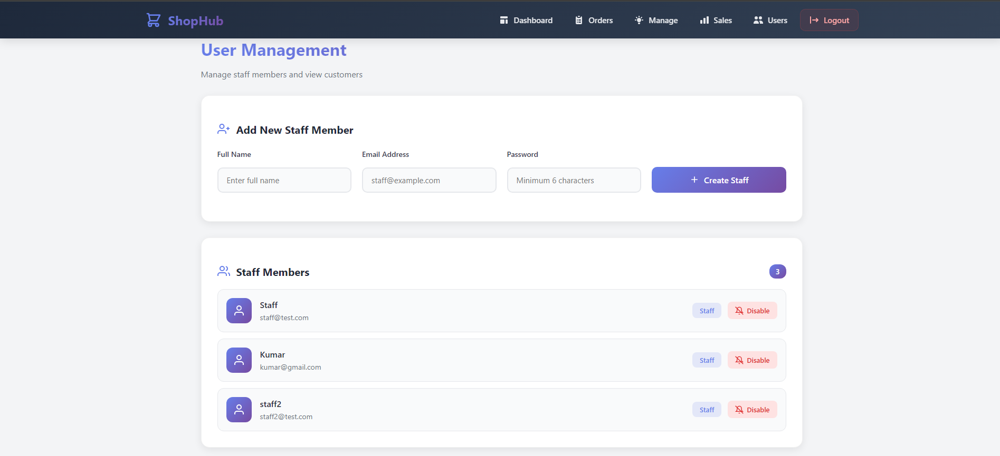
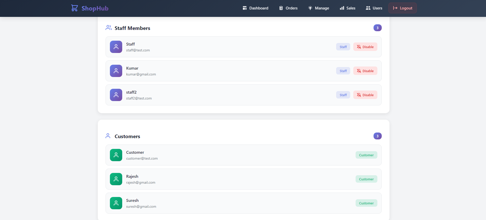
*Manage all system users (customers, staff, admins)*

#### Sales Analytics

*Detailed sales reports and analytics dashboard*

#### All Orders Management
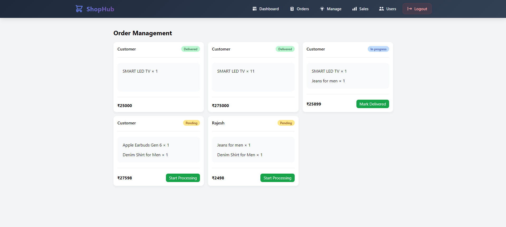
*View and manage all orders across the system*

---

> **Note**:  To add screenshots, create a `screenshots` folder in the root of your repository and add your images with the exact names shown above. 

## 🚀 Features

### 👥 Role-Based Access Control
- **Customer**: Browse products, place orders, track purchases
- **Staff**: Process orders, manage inventory, record sales
- **Admin**: Full system control, user management, analytics

### Core Functionality
- **Product Management**:  Complete CRUD operations for products
- **Shopping Cart**: Add, update, remove items before checkout
- **Order Management**: Create, track, and manage orders
- **Sales Tracking**: Record and monitor sales transactions
- **User Authentication**:  Secure login with JWT and role-based authorization
- **User Management**: Admin can create, edit, and manage all users
- **File Uploads**: Support for product images and documents
- **Analytics Dashboard**: Sales reports and business insights
- **Inventory Tracking**: Real-time stock management and alerts
- **Responsive Design**:  Optimized for all devices

## 👤 User Roles & Permissions

### Customer
- ✅ Browse products catalog
- ✅ Add products to cart
- ✅ Place and checkout orders
- ✅ View order history
- ✅ Track order status
- ✅ Manage personal profile
- ❌ Cannot access staff or admin features

### Staff
- ✅ View customer orders
- ✅ Process and update orders
- ✅ View inventory levels
- ✅ Record sales
- ✅ Access basic reports
- ❌ Cannot manage users or products
- ❌ Cannot access full admin features

### Admin
- ✅ Full system access
- ✅ Manage all products (add, edit, delete)
- ✅ Manage all users (customers, staff, admins)
- ✅ View all orders and sales
- ✅ Access analytics and reports
- ✅ Configure system settings
- ✅ Inventory management
- ✅ Generate business reports

## 🛠️ Tech Stack

### Frontend
- **React 19.2** - Modern UI library
- **Vite** - Fast build tool and dev server
- **Material-UI (MUI)** - Component library for elegant UI design
- **React Router DOM** - Client-side routing
- **Axios** - HTTP client for API calls
- **Emotion** - CSS-in-JS styling

### Backend
- **Node.js** with **Express 5.2** - Server framework
- **MongoDB** with **Mongoose** - Database and ODM
- **JWT (jsonwebtoken)** - Authentication and authorization
- **bcryptjs** - Password hashing
- **Multer** - File upload handling
- **CORS** - Cross-origin resource sharing
- **dotenv** - Environment variable management

## 📁 Project Structure

```
Inventory-sales-management-system/
├── backend/
│   ├── config/          # Configuration files (database, JWT)
│   ├── middleware/      # Custom middleware (auth, role verification)
│   ├── models/          # Mongoose models (User, Product, Sale, Order)
│   ├── routes/          # API route handlers
│   │   ├── auth.js      # Authentication routes
│   │   ├── products.js  # Product management routes
│   │   ├── orders.js    # Order management routes
│   │   ├── sales.js     # Sales routes
│   │   └── users.js     # User management routes
│   ├── uploads/         # File upload directory
│   ├── server.js        # Main server entry point
│   └── package. json
├── frontend/
│   ├── public/          # Static assets
│   ├── src/
│   │   ├── components/  # Reusable React components
│   │   ├── pages/       # Page components
│   │   │   ├── public/  # Home, Login, Register
│   │   │   ├── customer/# Customer portal pages
│   │   │   ├── staff/   # Staff portal pages
│   │   │   └── admin/   # Admin portal pages
│   │   ├── context/     # React context (auth, cart)
│   │   ├── utils/       # Utility functions
│   │   └── App.jsx      # Main app component
│   ├── index.html
│   ├── vite.config.js
│   └── package.json
├── screenshots/         # Application screenshots for README
└── README.md
```

## 🚦 Getting Started

### Prerequisites
- Node. js (v14 or higher)
- MongoDB (local or cloud instance like MongoDB Atlas)
- npm or yarn package manager

### Installation

1. **Clone the repository**
   ```bash
   git clone https://github.com/mrparsekar/Inventory-sales-management-system.git
   cd Inventory-sales-management-system
   ```

2. **Backend Setup**
   ```bash
   cd backend
   npm install
   ```

   Create a `.env` file in the backend directory: 
   ```env
   PORT=5000
   MONGODB_URI=your_mongodb_connection_string
   JWT_SECRET=your_jwt_secret_key
   NODE_ENV=development
   ```

   Start the backend server:
   ```bash
   npm start
   ```

3. **Frontend Setup**
   ```bash
   cd ../frontend
   npm install
   ```

   Create a `.env` file in the frontend directory (if needed):
   ```env
   VITE_API_URL=http://localhost:5000/api
   ```

   Start the development server:
   ```bash
   npm run dev
   ```

The frontend will typically run on `http://localhost:5173` and the backend on `http://localhost:5000`.

## 📊 Data Models

### User
- Username
- Email
- Password (hashed with bcrypt)
- Role (customer, staff, admin)
- Profile information
- Created date

### Product
- Name
- Description
- Price
- Category
- Stock quantity
- Images/Files
- Status (active/inactive)
- Created/Updated dates

### Sale
- Product reference
- Quantity sold
- Total amount
- Sale date
- Staff reference (who recorded the sale)

### Order
- Customer reference
- Product items (array)
- Total amount
- Status (pending, processing, shipped, delivered, cancelled)
- Shipping address
- Payment information
- Order date
- Updated date

### Cart (Session-based or Database)
- User reference
- Products (array with quantities)
- Total amount

## 🔐 Authentication & Authorization

The application uses JWT (JSON Web Tokens) for secure authentication with role-based access control: 

1. User logs in with credentials
2. Server validates and returns JWT token with user role
3. Token is stored in client (localStorage/sessionStorage)
4. Protected routes verify token and check user role
5. Backend middleware ensures users can only access authorized resources

## 📝 API Endpoints

### Authentication
- `POST /api/auth/register` - Register new user
- `POST /api/auth/login` - User login
- `GET /api/auth/me` - Get current user

### Products
- `GET /api/products` - Get all products (public)
- `GET /api/products/:id` - Get single product
- `POST /api/products` - Create product (admin only)
- `PUT /api/products/:id` - Update product (admin only)
- `DELETE /api/products/:id` - Delete product (admin only)

### Orders
- `GET /api/orders` - Get orders (filtered by role)
- `GET /api/orders/:id` - Get single order
- `POST /api/orders` - Create order (customer)
- `PUT /api/orders/:id` - Update order (staff/admin)
- `DELETE /api/orders/:id` - Cancel order

### Sales
- `GET /api/sales` - Get sales records (staff/admin)
- `POST /api/sales` - Record sale (staff/admin)
- `GET /api/sales/reports` - Get sales reports (admin)

### Users
- `GET /api/users` - Get all users (admin only)
- `GET /api/users/:id` - Get user details (admin only)
- `PUT /api/users/:id` - Update user (admin only)
- `DELETE /api/users/:id` - Delete user (admin only)

## 🎨 Frontend Scripts

- `npm run dev` - Start development server
- `npm run build` - Build for production
- `npm run preview` - Preview production build
- `npm run lint` - Run ESLint

## 🔧 Backend Scripts

- `npm start` - Start the server

## 🧪 Default Test Credentials

After setting up the database, you can create test users for each role:

```javascript
// Customer
Email: customer@test.com
Password: customer123

// Staff
Email: staff@test.com
Password: staff123

// Admin
Email: admin@test.com
Password: admin123
```

> **Note**: Change these credentials in production! 

## 📷 How to Add Screenshots

1. Create a `screenshots` folder in the root directory
2. Take screenshots of each page mentioned above
3. Name them exactly as referenced in this README
4. Recommended image format: PNG or JPG
5. Optimize images to keep file sizes reasonable (use TinyPNG)
6. Upload to repository: 
   ```bash
   mkdir screenshots
   # Add your screenshot files to the screenshots folder
   git add screenshots/
   git commit -m "Add application screenshots"
   git push
   ```

## 🤝 Contributing

Contributions are welcome! Please feel free to submit a Pull Request.

1. Fork the project
2. Create your feature branch (`git checkout -b feature/AmazingFeature`)
3. Commit your changes (`git commit -m 'Add some AmazingFeature'`)
4. Push to the branch (`git push origin feature/AmazingFeature`)
5. Open a Pull Request

## 🐛 Known Issues

- List any known issues or limitations here

## 🔮 Future Enhancements

- [ ] Payment gateway integration
- [ ] Email notifications
- [ ] Advanced analytics dashboard
- [ ] Export reports to PDF/Excel
- [ ] Product reviews and ratings
- [ ] Wishlist functionality
- [ ] Multi-language support
- [ ] Dark mode

## 📄 License

This project is licensed under the ISC License. 

## 👤 Author

**mrparsekar**
- GitHub: [@mrparsekar](https://github.com/mrparsekar)

## 🙏 Acknowledgments

- Material-UI for the beautiful component library
- MongoDB for the flexible database solution
- The React and Node.js communities for excellent documentation
- JWT for secure authentication

## 📞 Support

For support, email your-email@example.com or open an issue in the repository. 

---

⭐ **If you find this project helpful, please give it a star!** ⭐
